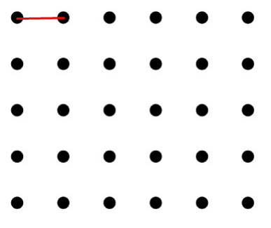
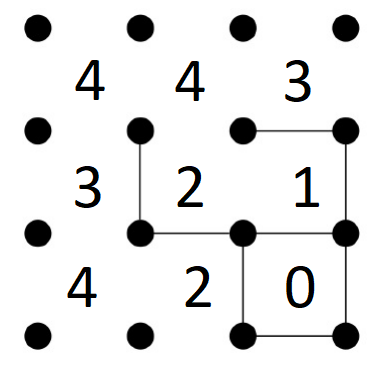

# Projeto Nº1: Época Normal - Fase nº 1 

## Inteligência Artificial 22/23
Prof. Joaquim Filipe

Eng. Filipe Mariano
# Jogo Dots and Boxes

## Manual Técnico

Realizado por:

Miguel Rodrigues - 202001391

João Marques - 202000432

Gabriel Garcia - 

21 de Dezembro de 2019

# Indice 

1. Introdução
2. Arquitetura do Sistema
3. Entidades e sua implementação
4. Algoritmos e sua implementação
5. Resultados
6. Limitações técnicas e ideias para desenvolvimento futuro

# Introdução

Neste documento iremos abordar uma versão simplificada do problema "Jogo Dots and Boxes".

A sua implementação com o A*, BFS, DFS e os seus resultados.


# Arquitetura do Sistema


A estrutura do projeto está organizada em 5 ficheiros:

- projeto.lisp - Interação com o utilizador, escrita e leitura de ficheiros.
- puzzle.lisp - Implementação da resolução do problema incluindo seletores, operadores heuristicas e outras funcõess auxiliares.
- procura.lisp - Implementação dos algoritmos de procura BFS, DFS e A*.
- problemas.dat - Tabuleiros representantes do problema.
- solucao.txt - A solução ao problema dado mais os seus dados estatisticos.

# Entidades e sua implementação


  ## Tabuleiro  

O tabuleiro é uma lista de listas, em que a primeira lista são as arestas horizontais por linha e a segunda lista são as arestas verticais por coluna.

```Lisp
    (((0 0 0)(0 0 1)(0 1 1)(0 0 1))((0 0 0)(0 1 0)(0 0 1)(0 1 1)))
```
 ---

## Operadores

Existem 2 tipos de operadores, que podem ter um numero variavel de filhos dependendo do tamanho do tabuleiro.

Os operadores são os seguintes:

```Lisp
(arco-horizontal no posicao indice lista (valor-default 1))
```
```Lisp
(arco-vertical no posicao indice lista (valor-default 1))
```

Os operadores preenchem uma posição aresta do tabuleiro, retornam nil se esta já existir.



Existe uma função operadores que gera todos os operadores possiveis para um dado nó dos 2 tipos:

```Lisp
(defun operadores (cl &optional (pos 1) (i 1))
 (cond
  ((equal pos (+ 1 cl)) nil)
  ((not (equal cl i)) (append (list(list 'arco-vertical pos i '(get-arcos-horizontais ))) (list(list 'arco-horizontal pos i '(get-arcos-verticais ))) (operadores cl pos (+ i 1))) )
  ((equal cl i) (operadores cl (1+ pos) 1))
 )
)

```
## Nó

### Composição do Nó

A composição do nó é uma lista composta por:

(Tabuleiro | Profundidade | Heuristica | Pai)

```Lisp
(defun cria-no (tabuleiro g h pai)
 (list tabuleiro g h pai)
)
```


## Seletores do Nó
Os seletores do Nó são seletores que retornam os atributos que o compõem.

Nomeadamente:

- *no-estado*
- *no-profundidade*
- *no-pai* 
- *no-heuristica* 
- *no-custo* 
- *get-arcos-horizontais*
- *get-arcos-verticais*
- *get-arco-na-posicao*
  

## Sucessões

A Sucessão de um determinado nó, é um conjunto de movimentos permitidos apara colocar uma nova aresta no tabuleiro.


```Lisp
(defun novo-sucessor (pai op)
 (cond
  ((equal nil (funcall (first op) pai (second op) (third op) (funcall (car (fourth op)) pai))) nil)
  (t (cria-no (funcall (first op) pai (second op) (third op) (funcall (car (fourth op)) pai)) (+ 1 (no-profundidade pai)) (heuristica (list (funcall (first op) pai (second op) (third op) (funcall (car (fourth op)) pai))) (get-objective))  pai))
 )
)

(defun sucessores (no opsList)
 (remove nil (mapcar #'(lambda (op) (novo-sucessor no op)) opsList))
)  
```

# Algoritmos e sua implementação

No âmbito deste projeto considera-se que o problema consiste em descobrir o menor numero de jogados que fecham 'x' caixas (x = objetivo).


### Solução 

A solução é uma função de paragem aos algorimos implementados que consistem em verificar se o numero de caixas fechadas de um dado nó é igual ao objetivo.


| Problema      |   Objetivo   |
| ------------- |:-------------:| 
| A  | 3    |  
| B  | 7    |  
| C  | 10   |  
| D  | 10   |   
| E  | 20   | 
| F  | 35  | 


```Lisp
(defun no-objetivop (no objetivo &optional (cl (length (car (no-estado no)))))
 (cond
  ((equal objetivo (nCaixasFechadas no cl)) T)
  (t nil)
 )
)

(defun nCaixasFechadas (no &optional (cl (length (car (no-estado no)))) (iL 1)(posL 1)(iC 1)(posC 1)(caixas 0)(itNumber 1))
 (cond
  ((equal itNumber cl) caixas)
  ((equal cl posC) (nCaixasFechadas no cl 1 (+ posL 1) (+ iC 1) 1 caixas (+ itNumber 1)))
  ((and (equal 1 (get-arco-na-posicao posL iL (get-arcos-horizontais no)))(equal 1 (get-arco-na-posicao (+ 1 posL) iL (get-arcos-horizontais no)))(equal 1 (get-arco-na-posicao posC iC (get-arcos-verticais no)))(equal 1 (get-arco-na-posicao (+ 1 posC) iC (get-arcos-verticais no)))) (nCaixasFechadas no cl (+ iL 1) posL iC (+ posC 1)(+ caixas 1) itNumber))
  ((not(and (equal 1 (get-arco-na-posicao posL iL (get-arcos-horizontais no)))(equal 1 (get-arco-na-posicao (+ 1 posL) iL (get-arcos-horizontais no)))(equal 1 (get-arco-na-posicao posC iC (get-arcos-verticais no)))(equal 1 (get-arco-na-posicao (+ 1 posC) iC (get-arcos-verticais no))))) (nCaixasFechadas no cl (+ iL 1) posL iC (+ posC 1) caixas itNumber))
 )
)
```

Neste projecto, iremos detalhar os algoritmos implementdos abaixo.

## BFS (Breadth First Search)
Na teoria dos grafos, busca em largura é um algoritmo de busca em grafos utilizado para realizar uma busca ou travessia num grafo e estrutura de dados do tipo árvore. Intuitivamente, começa-se pelo vértice raiz e explora todos os vértices vizinhos.


```Lisp
;;; (bfs [operadores: Conjunto de Operadores] [abertos: Lista de abertos inicializada com o no incial] [fechados: Lista de fechados vazia] [pop-no: Atomo que guarda o no retirado da lista de abertos] [it: Atmo de controlo dentro da função recursiva] [bool: Atmo que impede que a função recursiva de devolver nil na primeira iteração]
(defun bfs (objetivo operadores &optional (abertos (list (no-teste))) fechados pop-no (it 1)(bool 0)(starting-time (get-universal-time)))
 (cond
  ((and (not(eq bool 1))(null abertos)) nil)
  ((eq it 1) (bfs objetivo operadores (cdr abertos) (append (list (car abertos))fechados) (car abertos) 2 (+ bool 1) starting-time))
  ((not (eq nil (sucessor-e-objetivo (sucessores pop-no operadores) objetivo))) (list (sucessor-e-objetivo (sucessores pop-no operadores) objetivo)(+(length abertos)(length fechados))(- (length fechados) 1)(/ (length fechados) (+ (length fechados)(length abertos))) (- (get-universal-time) starting-time)))
  ((eq it 2) (bfs objetivo operadores (append abertos (compile-sucessores-fechados (compile-sucessores-abertos (sucessores pop-no operadores) abertos) fechados)) fechados pop-no 1 1 starting-time))  
 )
)
```


## DFS (Depth-first search)
Na teoria dos grafos, busca em profundidade é um algoritmo usado para realizar uma busca ou travessia numa árvore, estrutura de árvore ou grafo. Intuitivamente, o algoritmo começa num nó raiz e explora tanto quanto possível cada um dos seus ramos, antes de retroceder.


```Lisp
;;; Implementação do DLS(Depth Limit Search) = DFS+DEPTH-LIMIT
;;; (dls [operadores: Conjunto de Operadores] [abertos: Lista de abertos inicializada com o no incial] [fechados: Lista de fechados vazia] [pop-no: Atomo que guarda o no retirado da lista de abertos] [it: Atmo de controlo dentro da função recursiva] [bool: Atmo que impede que a função recursiva de devolver nil na primeira iteração]
(defun dls (objetivo depth operadores &optional (abertos (list (no-teste))) fechados pop-no (it 1)(bool 0)(starting-time (get-universal-time)))
 (cond
  ((and (not(eq bool 1))(null abertos)) nil)
  ((eq it 1)(dls objetivo depth operadores (butlast abertos) (append (list (car (last abertos))) fechados) (car (last abertos)) 2 (+ bool 1) starting-time))
  ((and (eq it 2)(< (no-profundidade pop-no) depth))(dls objetivo depth operadores abertos fechados pop-no 3 1 starting-time))
  ((and (eq it 2)(>= (no-profundidade pop-no) depth))(dls objetivo depth operadores abertos fechados pop-no 1 1 starting-time))
  ((and (eq it 3)(sucessor-e-objetivo (sucessores pop-no operadores) objetivo)) (list (sucessor-e-objetivo (sucessores pop-no operadores) objetivo)(+(length abertos)(length fechados))(- (length fechados) 1)(/ (length fechados) (+ (length fechados)(length abertos)))(- (get-universal-time) starting-time) ))
  (t (dls objetivo depth operadores (append (compile-sucessores-fechados (compile-sucessores-abertos (sucessores pop-no operadores) abertos) fechados) abertos) fechados pop-no 1 1 starting-time))
 )
)
```


## A* (A* Search Algorithm)
É um algoritmo de pesquisa que é utilizado para encontrar o caminho mais curto entre um ponto inicial e um ponto final. É um algoritmo útil que é muitas vezes utilizado para a travessia do mapa a fim de encontrar o caminho mais curto.

### No de menor custo
A nossa implementação do algoritmo inves de ordenar-nos e carregar o de menor custo (Primeiro ordenado), procura diretamente na lista o de menor custo sem ordenar:

```LISP
;;; Devolve a posição na lista de abertos do no de menor custo.
;;; (pos-no-menor-custo-a* [abertos: Lista de abertos] [no: Primeiro no da Lista de abertos] [i: Atmo auxiliar] [pos: Atmo devolve a posição do no] )
(defun pos-no-menor-custo-a* (abertos &optional (no (car abertos)) (i 0)(pos 0))
 (cond
  ((null abertos) pos)
  ((< (no-custo (car abertos)) (no-custo no)) (pos-no-menor-custo-a* (cdr abertos) (car abertos) (+ i 1) i))
  (t (pos-no-menor-custo-a* (cdr abertos) no (+ i 1) pos))
 )
)

;;; Devolve o no da lista de abertos de menor custo.
;;; (no-menor-custo-a* [abertos: Lista de abertos] [no: Primeiro no da Lista de abertos] [i: Atmo auxiliar] [pos: Atmo devolve a posição do no] )
(defun no-menor-custo-a* (abertos &optional (no (car abertos)) (i 0)(pos 0))
 (cond
  ((null abertos) no)
  ((< (no-custo (car abertos)) (no-custo no)) (no-menor-custo-a* (cdr abertos) (car abertos) (+ i 1) i))
  (t (no-menor-custo-a* (cdr abertos) no (+ i 1) pos))
 )
)

;;; Devolve a lista de abertos sem o no de menor custo
;;; (pos-no-menor-custo-a* [abertos: Lista de abertos] [pos: Posição do no na lista])
(defun abertos-sem-no-menor-custo-a* (abertos pos)
 (cond
  ((eq 1(length abertos)) (cdr abertos))
  (t (append (subseq abertos 0 pos)(subseq abertos (+ pos 1))))
 )
)
  ```

### Heurística
A procurar por heurística permite realizar a pesquisa por meio da quantificação de proximidade de um determinado objetivo, neste projeto iremos utlizar heurística para encontrarmos as possiveis soluções consoante os objetivos de cada tabuleiro. 

```LISP
    (LET ((heuristica))
      (defun definir-heuristica(x) (setf heuristica-def x))
      (defun heuristica-usada()
        (cond
        ((equal heuristica-def  'base ) 'h   )
        ((equal heuristica-def  'implementada ) 'h   )
        (t  nil)
        )))
```
---
#### Heuristica Base
A heuristica disponiblizada no enuciado é:

*h(x)=o(x)-m(x)*

*m(x) é o objetivo do dado problema*

*o(x) é o número de pontos de caixas fechadas*

---
#### Heuristica Desenvolvida

A nossa heuristica analisa o tabuleiro e faz o somatório do numero de arestas vizinhas que cada nó-caixa tem no momento (Um nó com mais arestas está mais "fechado" que um sem, uma caixa é composta por 4 arestas)

*h(x)=m(x)*

*m(x) é o $\sum$( 4 - $\sum$( numero de arestas vizinhas de um nó-caixa))*



# Limitações técnicas e ideias para desenvolvimento futuro


Ao longo do desenvolvimento do projeto, tivemos algumas dificuldades em implementar os algoritimos de procura, tendo encontrado alguns problemas com lispworks ao ter a memoria demasiado pequena no espaço da procura, sempre que utiliza-se o algoritmo BFS, DFS e A* com a heuristica base. 

Tivemos tambem algumas dificuldades em resolver bugs do programa pois o debugger de LISP é dificil de utilizar e não conclusivo.
  

# Resultados

Para poder comparar a eficácia dos 4 algoritmos funcionais foi feito uma tabela com as estatisticas de cada algoritmo na resolução de cada problema.

**ABF( Average Branching Factor )* - Fator Médio de Ramificação

## BFS (Breadth First Search)

| Problema         | Nós Gerados   | Nós Expandidos | *g(x)*   Profundidade  |Penetrância|Points|ABF
| --------- | :-------:|:--------:|:-------:| :---------:| :---------:| :--------:|
| A |   12   |  7    |  2    | 0.16666667   |49 |1.198952
| B |   30   |  13   |  1    | 0.033333335  |21 |1.4831691
| C |   12   |  2    |  0    | 0.0          |12 |1.198952
| D |   55   |  15   |  1    | 0.018181818  |97 |1.7105427
| E |   37   |  12   |  2    | 0.054054056  |56 |1.5400125
| F |  16938 |  2191 |  4    | 0.00023615539|282|4.893774


## DFS (Depth-first search)
*(Usando uma profundidade de 35)*

| Problema      | Nós Gerados   | Nós Expandidos | Profundidade *g(x)* | Penetrância|Points|ABF|Runtime
| ------------- |:-------------:| :------------:|:--------------:|:------------:| :---------:| :---------:|:---------:|  
| A  |   6   |  4   |  2    |  0.33333334  | 49| 1.0284217 | 0.001
| B  |   15   |  11    |  9    |  0.6   | 65| 1.2557953| 0.001
| C  |   11   |  5    |  3    |  0.27272728   | 154| 1.198952|0.001
| D  |   16    |  4    |  1    |  0.125     | 186| 1.3126388| 0.003|
| E  |   27  |  14   |  12   |  0.44444445  | 186| 1.4263256| 0.015|
| F  |   124   |  37   |  35   | 0.28225806 | 1975| 1.9947598| 0.022|


## A* (A* Search Algorithm)


| Problema      |    Nós Gerados   | Nós Expandidos | Profundidade *g(x)*  | Heuristíca *h(x)*| Penetrância|Points|ABF
| ---------- |:-------------:| :------------:|:--------------:|:------------:| :---------:| :---------:| :---------:| 
| A  |   8    |  6    |  2    | *h(x)=o(x)/m(x)* 1.5681818   |0.25|49|1.0852652
| B  |   15   |  7    |  1    |  *h(x)=o(x)/m(x)* 8.181818  |0.06666667| 21|1.2557953
| C  |   8    |  3    |  0    |  *h(x)=o(x)/m(x)* 0|0.0|12|1.0852652
| D  |   34   |  14   |  3    |  *h(x)=o(x)/m(x)* 8.988086|0.0882353| 197|1.5400125
| E  |   28   |  16   |  12   |  *h(x)=o(x)/m(x)* 9.593023 |0.42857143|226|1.4831691
| F  |   150  |  45   |  34   |  *h(x)=o(x)/m(x)* 5.263158 |0.22666668|1796|2.0516033

## SMA* (Simplified Memory Bounded A* Search Algorithm)

*(Usando como maximo de Memoria 4 Nós)*

| Problema      |    Nós Gerados   | Nós Expandidos | Profundidade *g(x)*  | Heuristíca *h(x)*| Penetrância|Points|ABF
| ---------- |:-------------:| :------------:|:--------------:|:------------:| :---------:| :---------:| :---------:| 
| A  |   8    |  6    |  2    |  1.5681818  | 0.25|49|1.0852652
| B  |   15   |  7    |  1    |  *h(x)=o(x)/m(x)* 8.181818  |0.06666667| 21|1.2557953
| C  |   8    |  3    |  0    |  *h(x)=o(x)/m(x)* 0|0.0|12|1.0852652
| D  |   34   |  14   |  3    |  *h(x)=o(x)/m(x)* 8.988086|0.0882353| 197|1.5400125
| E  |   28   |  16   |  12   |  *h(x)=o(x)/m(x)* 9.593023 |0.42857143|226|1.4831691
| F  |   150   |  43   |  32   |  9.51555 |0.21333334|1630|2.0516033


# Projeto Nº1: Época Normal 


## Inteligência Artificial 19/20
Prof. Joaquim Filipe

Eng. Filipe Mariano


# Jogo do Cavalo (Knight Game)


## Manual de Utilizador


Realizado por:

João Gomes - 150221001

André Gastão - 130221037

21 de Dezembro de 2019


# Indice

1. Introdução
2. Instalação
3. Configuração
4. Interface da Aplicação
5. Output


# Introdução

Este documento é escrito recorrendo á linguagem de marcação markdown, serve como relatório do Manual de Utilizador do projeto Jogo do Cavalo (Knight Game).

No âmbito da unidade curricular de Inteligência Artificial, foi nos proposto o projecto do jogo (Knight Game) originalmente criado a partir do problema matemático estudado em Inteligencia Artificial Knight's tour.
Neste documento serão descritos todos os passos para que o utilizador consiga instalar e  interagir com a aplicação do jogo.


# Instalação

A aplicação neçessita da instalação do IDE LispWorks.

LispWorks é uma Plataforma integrada que serve como ferramenta de desenvolvimento para Common Lisp.
Poderá adquirir o PersonalEdition e fazer o seu download  [aqui](http://www.lispworks.com/products/lispworks.html)


O sistema do Jogo do Cavalo foi implementado em linguagem LISP e foi desenvolvido com auxilio do IDE LispWorks. A estrutura do projeto é composta por 4 ficheiros:

- projeto.lisp - Interação com o utilizador, escrita e leitura de ficheiros.
- puzzle.lisp - Implementação da resolução do problema incluindo seletores, operadores heuristicas e outras funcõess auxiliares.
- procura.lisp - Implementação dos algoritmos de procura BFS, DFS e A*.
- problemas.dat - Funções com os problemas de A) a f).


# Configuração

 Visto que a estrutura do projeto é composta por 4 ficheiros distintos, para cada maquina temos de configurar o path ou o caminho da diretória desses ficheiros então a alteração a realizar deverá alterar o *Path* no ficheiro Projeto.Lisp

```Lisp
(defun diretoria-atual ()
"Define o caminho até ficheiros do projeto do root"
  (let ((path "C:\\Path Of Folder\\"))
    path
  )
)

(defun ficheiro-solucao ()
(let ((ficheiro-path  "C:\\Path Of Folder\\solucao.dat"))
    ficheiro-path
  )
)

```

Após a configuração do path temos entao de abrir o Lisp Works, de seguida abrir o ficheiro Projeto.Lisp e Compilar o mesmo.


# Interface da Aplicação

Com a instalação e a configuração dos ficheiros Podemos assim correr a aplicação:

- [x] Instalação
- [x] Configuração
- [ ] xecutar


Devido a consola não ser *Responsive* aconselha-se á maximização da janela do listener para ter uma melhor experiência de vizualização
# Home Menu

o menu principal mostra as opções do jogo, para qual o utilizador pode 
escolher uma das três opções para jogar e a opção quatro serve para sair 
do programa
```
      
      ______________________________________________________
      §                  JOGO DO CAVALO                      §
      §                  •(Knight Game) •                    §
      §                                                      §
      §                                                      §
      §                                                      §
      §                 1-Solve a Game                       §
      §                 2-Game Rules                         §
      §                 3-Show Boards                        §
      §                 4-Quit                               §
      §                                                      §
      §______________________________________________________§

      Option ->
```
# Solve a Game 
A opção solve a game ou resolver o jogo permite mostrar o menu dos problemas de A a F,
em que o utilizador deve escolher a opção 1 e carregar na tecla enter.

O novo menu mostra 6 opções dos problemas, na qual o utilizador pode escolher uma das 6 opções e sendo a setima (7) opção permite a saida do programa principal.

```
       ______________________________________________________
      §                CHOOSE THE BOARD                      §
      §                                                      §
      §                 1-Problem A                          §
      §                 2-Problem B                          §
      §                 3-Problem C                          §
      §                 4-Problem D                          §
      §                 5-Problem E                          §
      §                 6-Problem F                          §
      §                 7-Home Menu                          §
      §                                                      §
      §______________________________________________________§

      Option ->
```
## Solve Board

### Choose The Problem 
As opções problema A) à F), o utilizador pode escolher um dos problemas para que possa
obter uma solução e atingir o objetivo.
```
 ______________________________________________________
§                CHOOSE THE BOARD                      §
§                                                      §
§                 1-Problem A                          §
§                 2-Problem B                          §
§                 3-Problem C                          §
§                 4-Problem D                          §
§                 5-Problem E                          §
§                 6-Problem F                          §
§                 7-Home Menu                          §
§                                                      §
§______________________________________________________§

Option -> 
```
Neste Menu o utilizador pode escolher correr logo o Algoritmo ou colocar manualmente o cavalo em Jogo e Proceder á Procura da Solução.
```
______________________________________________________
§                                                      §
§                    • GAME MODES •                    §
§                                                      §
§                                                      §
§                 1-GO TO ALGORITHM                    §
§                 2-CONFIGURE BOARD                    §
§                                                      §
§                 0-Home Menu                          §
§                                                      §
§______________________________________________________§ 

Option ->
```
### Choose The Search Algorithm 
 Este menu permite escolher um dos algoritmos BFS,DFS e A*  implementados para obter o resultado de um problema proposto
```
          ______________________________________________________
          §                                                      §
          §                  CHOOSE ALGORITHM                    §
          §                (search algorithm)                    §
          §                                                      §
          §                 1-Algorithm BFS                      §
          §                 2-Algorithm DFS                      §
          §                 3-Algorithm A*                       §
          §                 4-Algorithm SMA*                     §
          §                 0-Home Menu                          §
          §                                                      §
          §______________________________________________________§

Option -> 
```
- ### BFS (Breadth First Search)

BFS ou opção 1, ao escolher este algoritmo o sistema irá resolver o problema escolhido.


- ### DFS (Depth First Search)

DFS ou opção 2: se utilizador optar por escolher o algoritmo DFS, terá de inserir em primeiro
o valor da profundidade para obter a solucão do problema escolhido.


- ### A* 

A* ou opção 3 do menu algoritmos, o utiliador pode escolher a opção 3 , onde o problema é resolvido atraves de heuritica, baseando nas formulas fornecidas pelo enunciado.
o menu heuristica permite que o utilizador escolha uma das duas opções a seguir.

```
 ______________________________________________________
§                          H                           §
§                     (HEURISTIC)                      §
§                                                      §
§                 1-Base (h(x)=o(x)/m(x))              §
§                 2-Base                               §    
§                 0-Home Menu                          §
§                                                      §
§______________________________________________________§

Heuristic -›
```
Os resultados obtidos ao escolher o algoritmo A*, com a base da opção 1

O algoritmo A* com a base da opção 1 mostra os resultados na secção A* output, em que as estatisticas correspondem aos seguintes valores:
G (Profundidade): 2, H (Heuristica): 1.568, tamanho da solução: 6,
Nós gerados: 8, Nós expandidos: 6, Penetração: 0.25, Pointos: 49
Objetivos: 70, Fator de ramificação: 1.085

- ### Outros resultados

# Game Rules 
o menu game rules mostra a descrição do jogo e suas regras
para que o utilizador possa compreender sobre o jogo antes de o iniciar.
```
___________________________   GAME RULES   ____________________________
                            (Knight Game)                  
     1- Esta versão do jogo consiste num tabuleiro 
        com 10 linhas e 10 colunas (10X10)
     2- Em que cada casa possui uma pontuação com valor entre 00 e 99 
        (Aleatório),sem repetição nas celulas do tabuleiro.
     3- O objectivo do jogo é acumular mais pontos que o adversário,
         usando um cavalo de xadrez.
        Cada jogador tem um cavalo da sua cor (branco ou preto).
     4- Todas as jogadas seguintes são efectuadas através de um movimento de cavalo
        (usando as regras tradicionais do Xadrez para o cavalo).
        Um cavalo não pode saltar para uma casa vazia (sem número)
        e também não pode fazê-lo para uma casa que esteja ameaçada pelo cavalo adversário.  
     5- O jogo termina quando não for possível movimentar 
        qualquer um dos cavalos no tabuleiro,
        sendo o vencedor o jogador que ganhou mais pontos.
________________________________________________________________________
```
# Show Boards
Nesta opção o utilizador pode visualizar a lista dos problemas, em que cada um dos problemas pode ser resolvido. 
- ### List of Boards

```
 ______________________________________________________
§              • CHOOSE THE BOARD •
§                                                      §
§                 1-Problem A                          §
§                 2-Problem B                          §
§                 3-Problem C                          §
§                 4-Problem D                          §
§                 5-Problem E                          §
§                 6-Problem F                          §
§                 7-Home Menu                          §
§                                                      §
§______________________________________________________§

Option ->

```


# QUIT 
O menu que permite ao utilizador sair do programa, sem ter a necessidade de realizar o jogo até  o fim ou atingir um dado objetivo.

O utilizador pode efectuar a paragem do jogo, usando a opção 4 do menu principal do jogo do cavalo como mostra abaixo.


# Output

## CONSOLE OUTPUT
O output de console é o resultado obtido atraves do tabuleiro criado e dos algoritmos BFS, DFS, A* 


## FILE OUTPUT
 O output do ficheiro é o resultado obtido através dos algoritmos implementados
  e são visualizdos no output console e no ficheiro de solução.dat,
  exemplo dos resultados obtidos no ficheiro solução segundo o diretoria: 

```
"C:\\Users\\andre.gastao\\Documents\\IA1920\\Projecto\\Projecto_2019_2020_IA_PreFinal\\Projecto_2019_2020_IA\\Projecto\\solucao.dat"

```
```
______________STATS______________ 

 _______  16:02:00 of Saturday, 12/21/2019 (GMT+0)  _______ 


 Final State: 

((NIL NIL T NIL NIL NIL NIL NIL NIL NIL)
 (NIL NIL NIL NIL NIL NIL NIL NIL NIL NIL)
 (NIL NIL NIL NIL NIL NIL NIL NIL NIL NIL)
 (NIL NIL NIL NIL NIL NIL NIL NIL NIL NIL)
 (NIL NIL NIL 22 NIL NIL NIL NIL NIL NIL)
 (NIL NIL NIL NIL NIL NIL NIL NIL NIL NIL)
 (NIL NIL NIL NIL NIL NIL NIL NIL NIL NIL)
 (NIL NIL NIL NIL NIL NIL NIL NIL NIL NIL)
 (NIL NIL NIL NIL NIL NIL NIL NIL NIL NIL)
 (NIL NIL NIL NIL NIL NIL NIL NIL NIL NIL))
 ___________________________________

          Algorithm: BFS 
          G (Depth): 2 
          H (Heuristic): 0
          Solution Length: 6
          Generated Nodes: 12
          Expanded Nodes: 7
          Penetration: 0.16666667
          Points: 49
          Objective: 70
          Average branching factor: 1.198952
          OBJECTIVE NOT REACHED  
```
